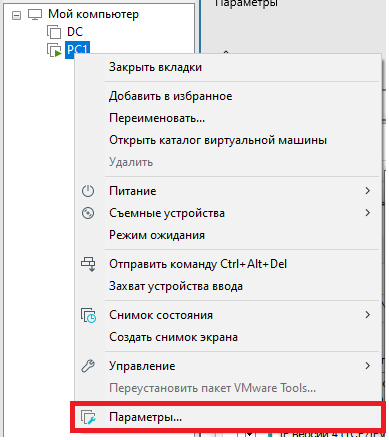
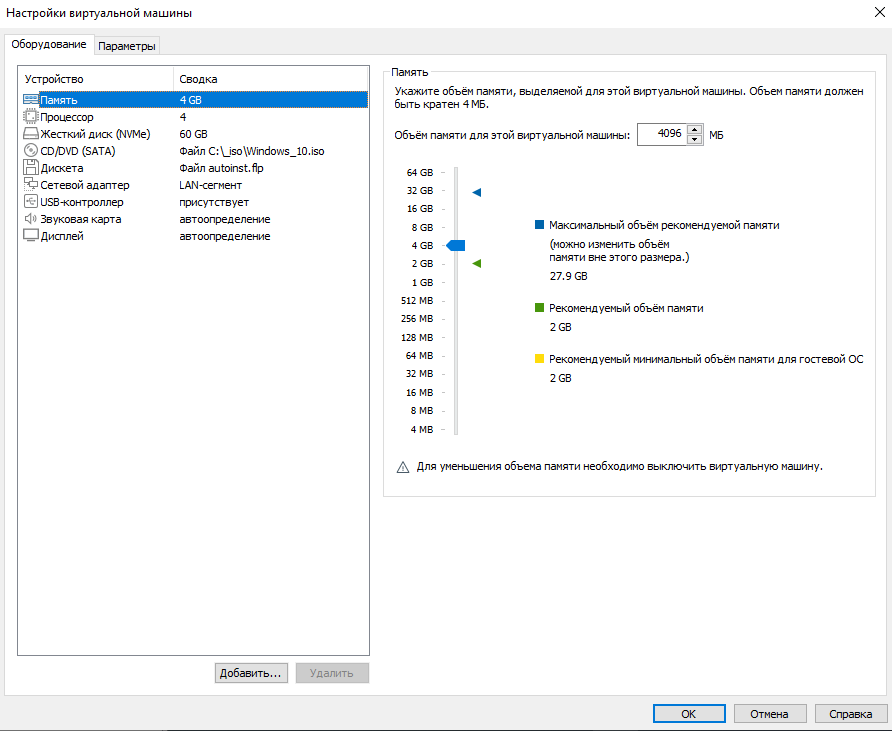
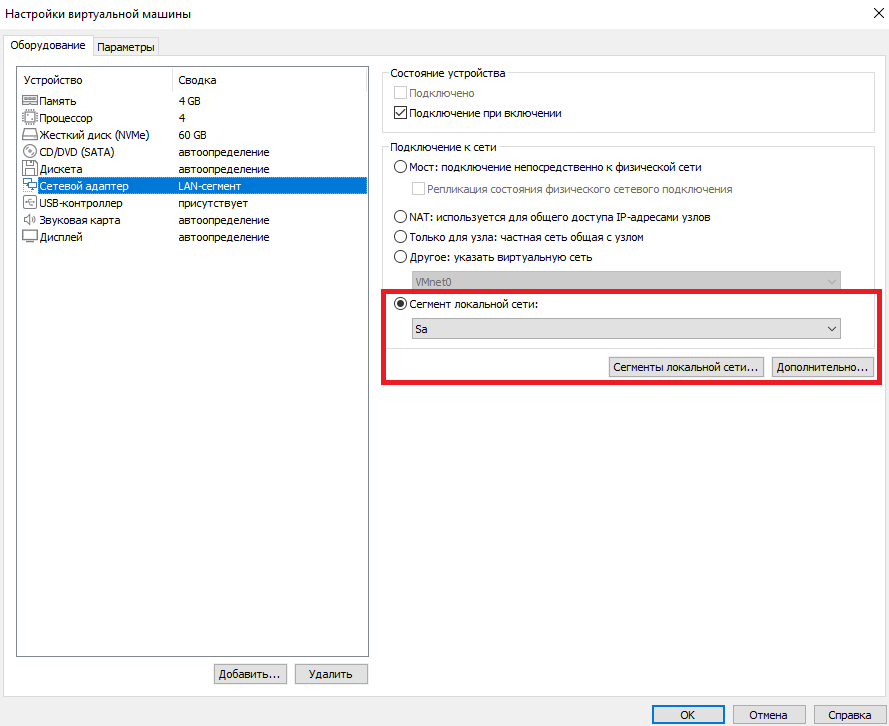
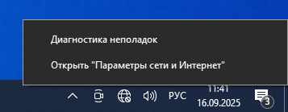
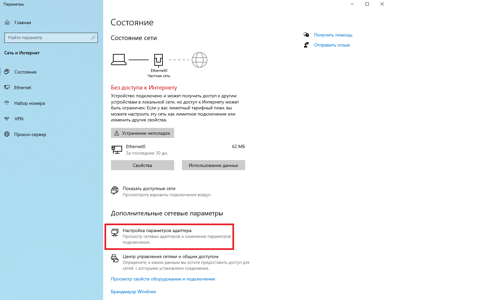
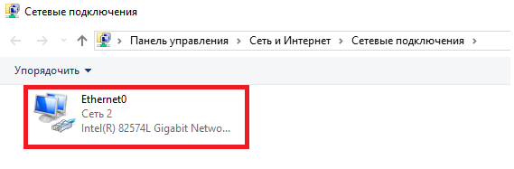
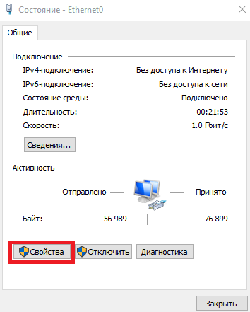
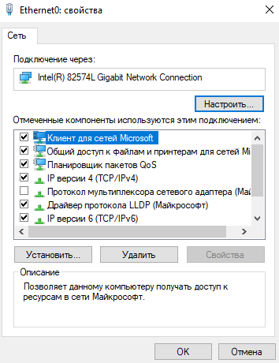

# Лабораторная работа №2
### Тема : Установка Windows 10 и настройка сети
**Выполнить отчет по данной работе:**  
```
- Вставить результаты выполнения пунктов  
```

### Цель : Научится соединять виртуальные машины и вводить компьютер в домен
---
### Порядок работы :

### 1. Установить Windows 10 (Процесс установки необходимо зафиксировать)
### 2. Настроить виртуальные машины



Открываем параметры виртуальной машины



В появивемся окне ищем параметр сетевой адаптер 



В меню справа выбираем `Сегмент локальной сети`

```
Это необходимо для объединения виртуальных машин в одну виртуальную локальную сеть

Если в появившемся меню нет сегмента, необходимо его создать.
Для этого нажмите кнопку `Сегменты локальной сети...`
```

ПРОДЕЛАЙТЕ ЭТОТ ЭТАП ДЛЯ ОБОИХ ВИРТУАЛЬНЫХ МАШИН!!!

### 3. Настройка сетевых реквизитов

Для дальнейшей работы с виртуальными нашинами, нам необходимо подружить их и обеспечить сетевое взаидействие, для этого нам необходимо выдать им IP-адресса в одной подсети и остальные сетевые реквизиты.



Для настройки сетевых реквизитов необходимо перейти в "Пареметры сети и Интернет"  
`Нажать ПКМ на значек интернета в панели TRAY`



В открывшемся окне необходимо нажать на пункт `Настройка параметров адаптера`



Дважды нажать `ЛКМ` на появившийся адаптер



Перейти в свойства адаптера



В появившемся меню выбрать протокол `IP версии 4`

`На КЛИЕНТЕ обязательное указать в качестве DNS и Шлюза IP-адресс вашего сервера`

Проверить Ping между устройствами

`Если Ping не проходит отключите брандмауэр`